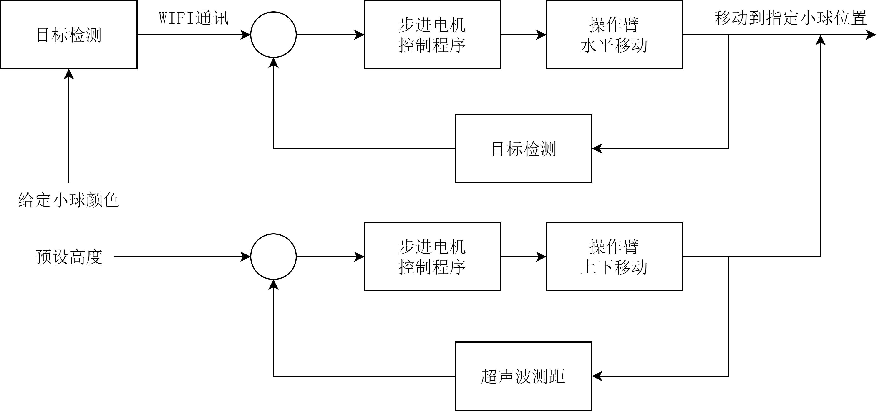

# 智能种植机
## 注意事项
本项目所展示代码只适用于华南理工大学自动化学院的种植机项目实验。嵌入式部分的代码有可能由于接线等问题导致错误甚至无法使用，请在使用前仔细检查接线是否正确。

## 快速开始

上图表示种植机的系统框架。分为目标检测，嵌入式设计和WIFI通讯三个部分的工作。

## 目标检测

### 安装Miniconda

点击[链接](https://github.com/ultralytics/yolov5)查看YOLOv5源码仓库。YOLOv5目标检测框架基于Pytorch深度学习框架实现，需要首先安装符合版本要求的Python环境和Pytorch框架。

```bash
# 2023年6月18日版本要求，最新版本要求见YOLOv5源码仓库的README
Python>=3.7.0, PyTorch>=1.7
```
这里推荐使用miniconda管理Python运行环境，下面的安装配置步骤以Windows系统为例。

首先从[清华镜像](https://mirrors.tuna.tsinghua.edu.cn/anaconda/miniconda/)下载miniconda安装包，根据指引进行安装。安装完成后配置国内镜像设置，这一步设置能加快各类Python库的下载速度。这里选用南方科技大学的conda镜像站。在`C:\Users\$YourName$\`路径下修改.condarc文件，其中`$YourName$`是当前电脑用户名。

第一次安装conda可能找不到.condarc文件，可以先在命令行运行下面指令，将自动创建.condarc文件：
```bash
conda activate base # 激活conda环境

conda config --show-sources # 展示镜像源
```


将.condarc文件修改为：
```bash
channels:
  - defaults
show_channel_urls: true
default_channels:
  - https://mirrors.sustech.edu.cn/anaconda/pkgs/main
  - https://mirrors.sustech.edu.cn/anaconda/pkgs/free
  - https://mirrors.sustech.edu.cn/anaconda/pkgs/r
  - https://mirrors.sustech.edu.cn/anaconda/pkgs/pro
  - https://mirrors.sustech.edu.cn/anaconda/pkgs/msys2
custom_channels:
  conda-forge: https://mirrors.sustech.edu.cn/anaconda/cloud
  msys2: https://mirrors.sustech.edu.cn/anaconda/cloud
  bioconda: https://mirrors.sustech.edu.cn/anaconda/cloud
  menpo: https://mirrors.sustech.edu.cn/anaconda/cloud
  pytorch: https://mirrors.sustech.edu.cn/anaconda/cloud
  simpleitk: https://mirrors.sustech.edu.cn/anaconda/cloud
  nvidia: https://mirrors.sustech.edu.cn/anaconda-extra/cloud
```

修改完成后在命令行分别运行下面指令，查看镜像是否修改成功。
```bash
conda clean -i # 清除索引

conda config --show-sources # 展示镜像源
```

### 创建虚拟环境
在命令行运行下面指令创建YOLOv5框架的运行环境。
```bash
conda create -n yolo python=3.9
```

-n后的参数指定环境名，可以随意取名。python=3.9表示运行环境的python版本，只要满足前面所述的YOLOv5的版本要求即可。环境创建完成后运行下面指令激活虚拟环境。
```bash
conda activate yolo
```

### 安装Pytorch
进入[Pytorch](https://pytorch.org/get-started/previous-versions/)官网，查找满足YOLOv5版本需求的Pytorch框架指令。以Pytorch 1.9.1 为例，官网下载指令如下：
```bash
# CUDA 10.2
conda install pytorch==1.9.1 torchvision==0.10.1 torchaudio==0.9.1 cudatoolkit=10.2 -c pytorch

# CUDA 11.3
conda install pytorch==1.9.1 torchvision==0.10.1 torchaudio==0.9.1 cudatoolkit=11.3 -c pytorch -c conda-forge

# CPU Only
conda install pytorch==1.9.0 torchvision==0.10.1 torchaudio==0.9.1 cpuonly -c pytorch
```

首先查看电脑显卡型号，对于较新型号的NVIDIA显卡强烈建议下载GPU版本，其他类型显卡的电脑建议先买张NVIDIA显卡然后下载GPU版本。CPU版本的Pytorch训练极慢，请珍惜光阴。

对于CUDA版本的选择，首先保证NVIDIA显卡驱动正确安装，在命令行运行：
```bash
nvidia-smi
```
右上角的CUDA Version表示当前显卡能安装的最高CUDA版本，只要选择小于这个版本号的CUDA安装即可。

在虚拟环境运行下面的代码测试能否成功调用GPU。关于如何选择不同虚拟环境的解释器处理代码，每个ide设置方法不同。可以在必应搜索“xxx如何选择python解释器”得到答案。

```python
import torch
flag = torch.cuda.is_available()
print(flag)

ngpu= 1
# Decide which device we want to run on
device = torch.device("cuda:0" if (torch.cuda.is_available() and ngpu > 0) else "cpu")
print(device)
print(torch.cuda.get_device_name(0))
print(torch.rand(3,3).cuda()) 
```

### 安装CUDA（OPTIONAL）
一般来说Pytorch的GPU版本安装完成后应该就能直接通过CUDA在NVIDIA显卡上进行训练了，因为Pytorch在安装时已经自带安装了CUDA。假如出现了无法通过GPU训练的问题可以尝试手动安装CUDA。

在[CUDA Toolkit](https://developer.nvidia.com/cuda-toolkit-archive)上下载CUDA驱动。具体下载哪个版本，参考Pytorch安装步骤。务必和之前安装Pytorch时选择的CUDA版本相同。

（一般的安装教程还会要求安装cudnn，不过我自己测试感觉是不太需要的，可以视情况决定是否安装）

### 安装YOLOv5依赖


