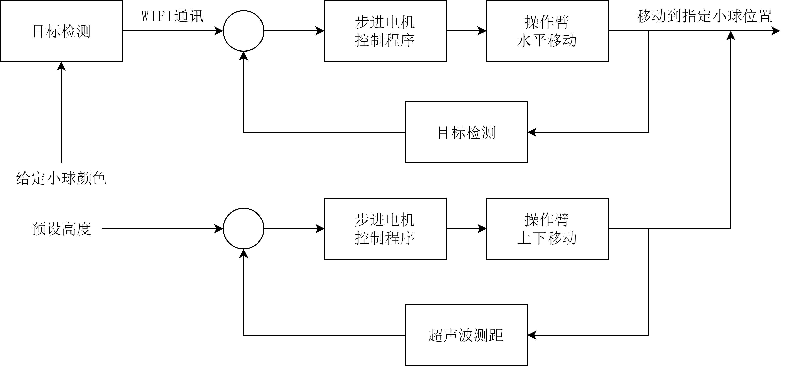
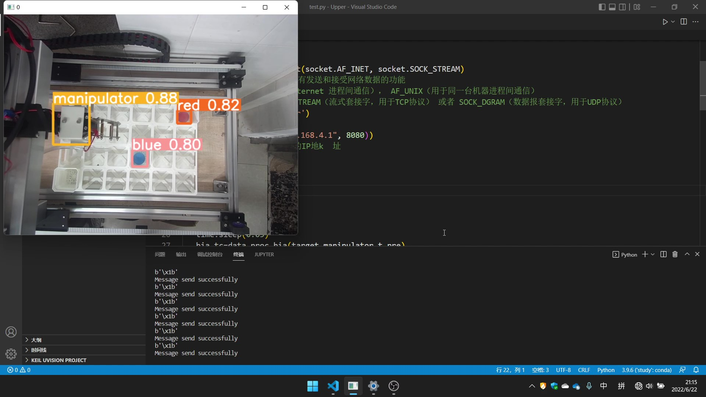

# 智能种植机
# 系统架构

上图表示种植机的系统框架。分为目标检测，嵌入式设计和WIFI通讯三个部分的工作。

# 环境配置
下面介绍各部分工作的环境配置。

## 目标检测
目标检测部分基于YOLOv5目标检测框架进行设计，代码保存在vision文件夹内。
### 安装Miniconda

点击[链接](https://github.com/ultralytics/yolov5)查看YOLOv5源码仓库。YOLOv5目标检测框架基于Pytorch深度学习框架实现，需要首先安装符合版本要求的Python环境和Pytorch框架。

```bash
# 2023年6月18日版本要求，最新版本要求见YOLOv5源码仓库的README
Python>=3.7.0, PyTorch>=1.7
```
这里推荐使用miniconda管理Python运行环境，下面的安装配置步骤以Windows系统为例。

首先从[清华镜像](https://mirrors.tuna.tsinghua.edu.cn/anaconda/miniconda/)下载miniconda安装包，根据指引进行安装。安装完成后配置国内镜像设置，这一步设置能加快各类Python库的下载速度。这里选用南方科技大学的conda镜像站。在`C:\Users\$YourName$\`路径下修改.condarc文件，其中`$YourName$`是当前电脑用户名。

第一次安装conda可能找不到.condarc文件，可以先在终端运行下面指令，将自动创建.condarc文件：
```bash
conda activate base # 激活conda环境

conda config --show-sources # 展示镜像源
```


将.condarc文件修改为：
```bash
channels:
  - defaults
show_channel_urls: true
default_channels:
  - https://mirrors.sustech.edu.cn/anaconda/pkgs/main
  - https://mirrors.sustech.edu.cn/anaconda/pkgs/free
  - https://mirrors.sustech.edu.cn/anaconda/pkgs/r
  - https://mirrors.sustech.edu.cn/anaconda/pkgs/pro
  - https://mirrors.sustech.edu.cn/anaconda/pkgs/msys2
custom_channels:
  conda-forge: https://mirrors.sustech.edu.cn/anaconda/cloud
  msys2: https://mirrors.sustech.edu.cn/anaconda/cloud
  bioconda: https://mirrors.sustech.edu.cn/anaconda/cloud
  menpo: https://mirrors.sustech.edu.cn/anaconda/cloud
  pytorch: https://mirrors.sustech.edu.cn/anaconda/cloud
  simpleitk: https://mirrors.sustech.edu.cn/anaconda/cloud
  nvidia: https://mirrors.sustech.edu.cn/anaconda-extra/cloud
```

修改完成后在终端分别运行下面指令，查看镜像是否修改成功。
```bash
conda clean -i # 清除索引

conda config --show-sources # 展示镜像源
```

### 创建虚拟环境
在终端运行下面指令创建YOLOv5框架的运行环境。
```bash
conda create -n yolo python=3.9
```

-n后的参数指定环境名，可以随意取名。python=3.9表示运行环境的python版本，只要满足前面所述的YOLOv5的版本要求即可。环境创建完成后运行下面指令激活虚拟环境。
```bash
conda activate yolo
```

### 安装Pytorch
进入[Pytorch](https://pytorch.org/get-started/previous-versions/)官网，查找满足YOLOv5版本需求的Pytorch框架指令。以Pytorch 1.9.1 为例，官网下载指令如下：
```bash
# CUDA 10.2
conda install pytorch==1.9.1 torchvision==0.10.1 torchaudio==0.9.1 cudatoolkit=10.2 -c pytorch

# CUDA 11.3
conda install pytorch==1.9.1 torchvision==0.10.1 torchaudio==0.9.1 cudatoolkit=11.3 -c pytorch -c conda-forge

# CPU Only
conda install pytorch==1.9.0 torchvision==0.10.1 torchaudio==0.9.1 cpuonly -c pytorch
```

首先查看电脑显卡型号，对于较新型号的NVIDIA显卡建议下载GPU版本，CPU版本的Pytorch训练极慢，只能作为调试使用。

对于CUDA版本的选择，首先保证NVIDIA显卡驱动正确安装，在终端运行：
```bash
nvidia-smi
```
右上角的CUDA Version表示当前显卡能安装的最高CUDA版本，只要选择小于这个版本号的CUDA安装即可。以CUDA 10.2为例，安装指令如下。
```bash
conda activate yolo #激活yolo虚拟环境

# CUDA 10.2
conda install pytorch==1.9.1 torchvision==0.10.1 torchaudio==0.9.1 cudatoolkit=10.2 -c pytorch
```

在yolo虚拟环境运行下面的代码测试能否成功调用GPU。在前面步骤没有出错的前提下，假如出现找不到库的情况，有可能是因为IDE没有选择正确的Python解释器。

```python
import torch
flag = torch.cuda.is_available()
print(flag)

ngpu= 1
# Decide which device we want to run on
device = torch.device("cuda:0" if (torch.cuda.is_available() and ngpu > 0) else "cpu")
print(device)
print(torch.cuda.get_device_name(0))
print(torch.rand(3,3).cuda()) 
```

### 安装CUDA（OPTIONAL）
一般来说Pytorch的GPU版本安装完成后应该就能直接通过CUDA在NVIDIA显卡上进行训练了，因为Pytorch在安装时已经自带安装了CUDA。假如出现了无法通过GPU训练的问题可以尝试手动安装CUDA。

在[CUDA Toolkit](https://developer.nvidia.com/cuda-toolkit-archive)上下载CUDA驱动。具体下载哪个版本，参考Pytorch安装步骤。务必和之前安装Pytorch时选择的CUDA版本相同。

（一般的安装教程还会要求安装cudnn，不过我自己测试感觉是不太需要的，可以视情况决定是否安装）

### 安装YOLOv5依赖
打开vision文件夹下的Yolo源码，在源码根目录打开终端，在终端输入下面指令：
```bash
conda activate yolo               # 激活yolo虚拟环境
pip install -r requirements.txt   # 安装YOLOv5依赖
```

完成YOLOv5依赖安装。至此YOLOv5目标检测框架运行环境配置完成。

## 嵌入式
我们采用天祥电子的51单片机作为嵌入式开发平台，代码保存在c51文件夹内。最重要的代码是zzjpro.c，其余代码都是编写过程中的测试程序。使用方法为通过Keil对zzjpro.c进行编译得到hex文件，并烧录到单片机上。

## 无线通讯
无线通讯部分代码保存在comm文件夹内。其中最重要的代码是upper_1.py和upper_2.py，其余代码都是编写过程中的测试程序。需要在当前的虚拟环境中安装serial库。

在完成前面目标检测环境配置的前提下，在终端输入下面指令：
```bash
conda activate yolo               # 激活yolo虚拟环境
pip install pyserial              # 安装serial库
```
其中upper_1.py是有线连接上位机代码，upper_2.py是无线连接上位机代码。

# 使用方法
首先将WebCam与电脑相连，同时将电脑与单片机进行连接，可以通过有线或WIFI的形式。

接着在vision文件夹下打开终端，输入下面命令运行目标检测程序：
```bash
conda activate yolo               # 激活yolo虚拟环境
python detect.py  --weights after_train_model/ball.pt --source 0 --save-txt --save-conf
```



--weights参数代表指定的神经网络模型，这里我们传入的参数表示指定after_train_model文件夹内的ball.pt作为预测使用的神经网络模型。ball.pt是我们预先训练好的一个神经网络模型，它能识别不同颜色的小球以及末端执行器的位置。

--source参数表示输入图像源来自第0个设备，通常我们插入WebCam后这个第0个设备就是我们外接的摄像头了，假如出现黑屏的情况可以尝试改变这里的参数值。

--save-txt和--save-conf参数表示我们将识别到的种类和位置信息保存在一个txt文件中，这个txt文件就是comm文件夹内的locdata.txt。

同时运行上位机程序，该程序主要的工作是读取locdata.txt内的内容转化为控制信号发送给单片机。在comm文件夹打开终端，输入下面命令运行上位机程序：
```bash
conda activate yolo               # 激活yolo虚拟环境
python upper_1.py                 # 有线连接上位机
```

这里以有线连接为例，对于WIFI连接还要先将计算机跟ESP模块建立连接。并运行upper_2.py文件。


